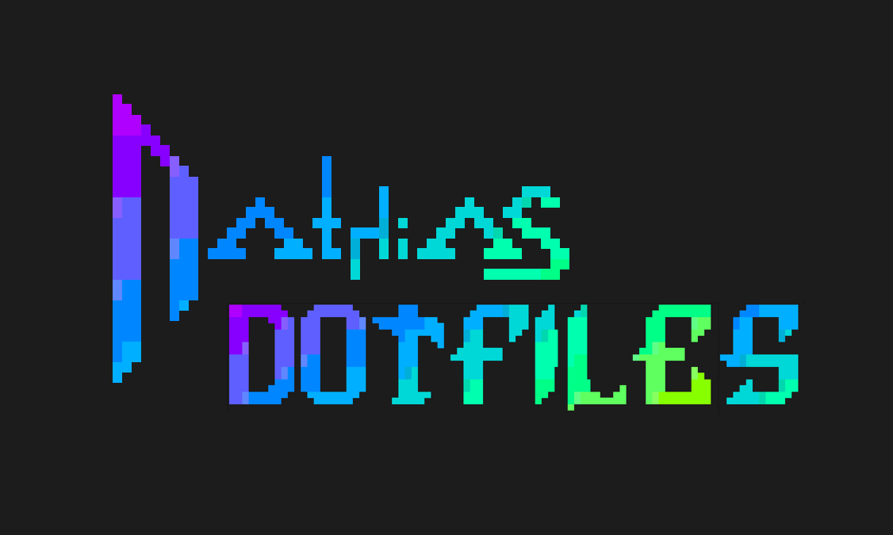
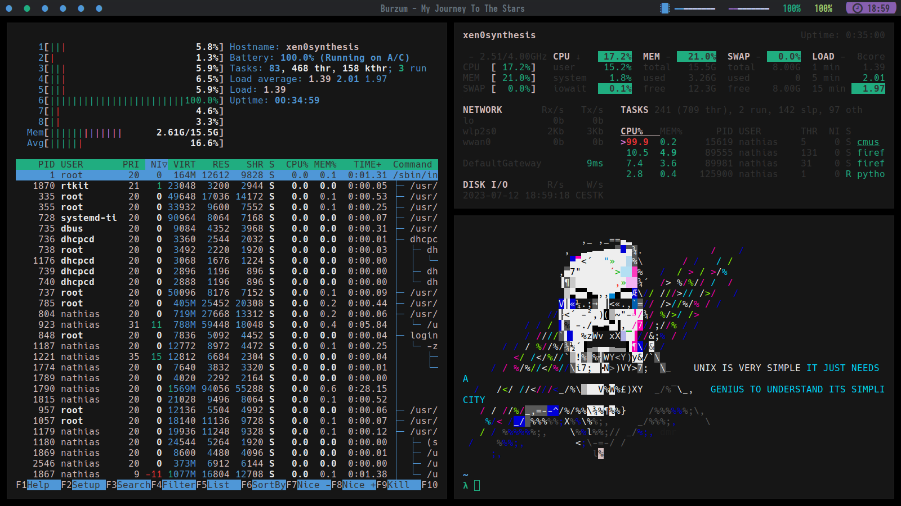
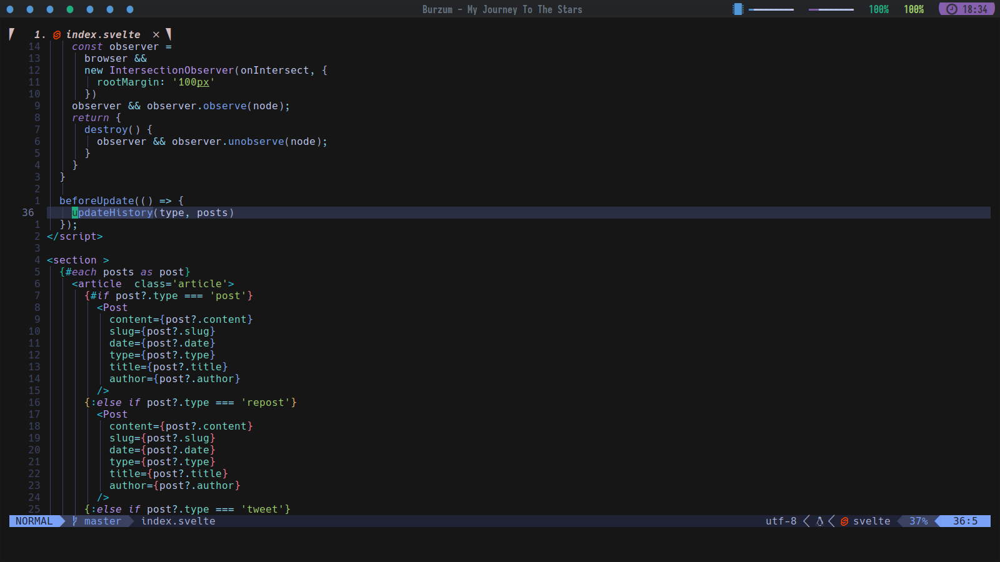
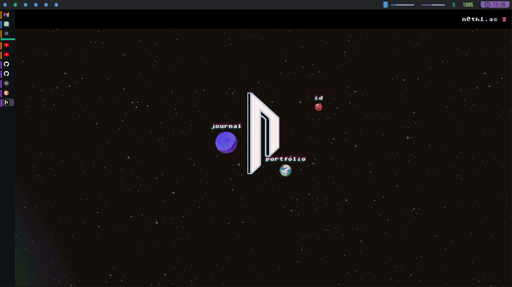
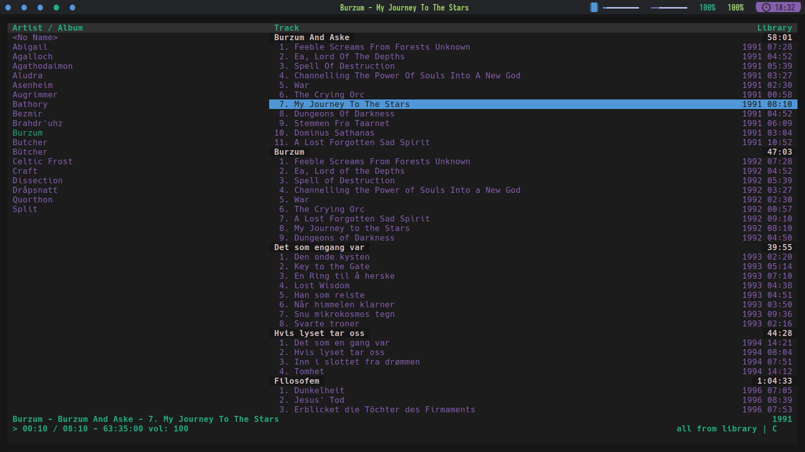
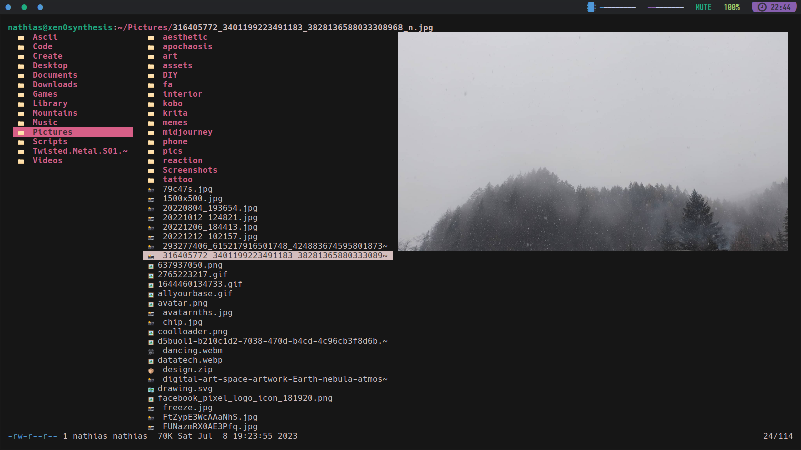
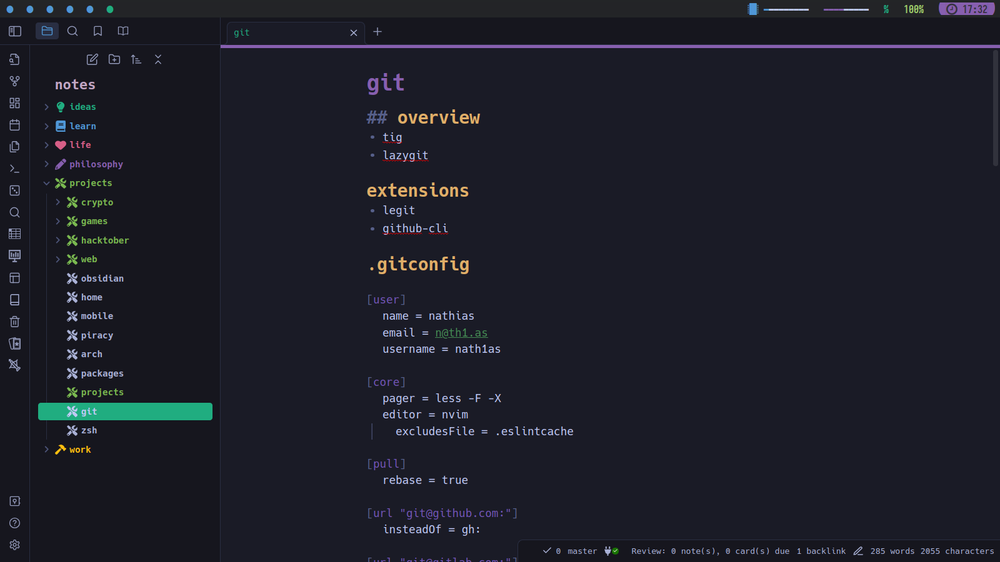

### [@nath1as](https://github.com/nath1as/)' dotfiles optimized for speed, UNIX as IDE and vim-keys everywhere

## ZSH



### packages

-   zsh
-   antibody
-   zoxide

### plugins

-   denysdovhan/spaceship-prompt
-   zdharma-continuum/fast-syntax-highlighting
-   zpm-zsh/colors
-   jeffreytse/zsh-vi-mode
-   zsh-users/zsh-completions
-   lukechilds/zsh-better-npm-completion
-   g-plane/zsh-yarn-autocompletions

### zshrc

[.zshrc](https://github.com/nath1as/.files/blob/master/zshrc)

## X

```bash
#!/bin/bash
[[ -f ~/.Xresources ]] && xrdb -merge ~/.Xresources
xset -b
st -q -o -f
xrandr --output eDP-1 --mode 1600x900 --rate 60
exec i3
```

## ST

suckless simple terminal (st) with vim bindings and Xresource compatibility.

[repo](https://github.com/nath1as/st)

[dir colors](https://github.com/nath1as/.files/blob/master/dircolors)

## NEOVIM




[nvim config](https://github.com/nath1as/nvim)

[lazyvim](https://github.com/folke/tokyonight.nvim)

[tokyonight theme](https://github.com/folke/tokyonight.nvim)

## i3

[config](https://github.com/nath1as/.files/blob/master/i3)

## polybar

[config](https://github.com/nath1as/.files/blob/master/polybar.ini)

## FIREFOX



### packages:

-   firefox

### customized browser
- 

### set about:config

-   disable Alt key menu toggle:
    ui.key.menuAccessKeyFocuses to false
-   disable the Quick Find hotkey:
    accessibility.typeaheadfind.manual to false
-  enable scripts to close windows:
    dom.allow_scripts_to_close_windows

## CMUS



[theme](https://github.com/nath1as/.files/blob/master/cmus)

## WEECHAT

### packages:

-   weechat
-   bitlbee-discord-git
-   bitlbee-facebook
-   bitlbee-libpurple
-   bitlbee-mastodon-git
-   bitlbee-steam-git

### scripts:

-   colorize_lines
-   autosort
-   automerge
-   bitlbee_completion
-   buffer_dmenu
-   cmus
-   go
-   twitch
-   urlserver
-   vimode
-   weestreamer

## TTY

edit /etc/issue to change login

```
                                                           
                                                           
 _______           __       _____   __                     
|   _   .----.----|  |--   |     |_|__.-----.--.--.--.--.  
|       |   _|  __|     |  |       |  |     |  |  |_   _|  
|___|___|__| |____|__|__|  |_______|__|__|__|_____|__.__|  
                                                           
                                                           
               :::xen0synthesis:::                       
              =======================                     
                                                           
                                                           
                                                           
                                                           
                                                           
```

## PARU

-   Color option in /etc/pacman.conf

## GIT

alias g="git"

### packages

-   git
-   tig
-   onefetch
-   lazygit
-   diff-so-fancy
-   git-crypt

### extensions

-   legit
-   github-cli

### .gitconfig

[.gitconfig](https://github.com/nath1as/.files/blob/master/gitconfig)

## Thunar

.local/share/applications/thunar.desktop

```zsh
[Desktop Entry]
Name=Thunar
Exec=env GTK_THEME=Adwaita:dark thunar %F
Icon=system-file-manager
Terminal=false
Type=Application
Categories=GTK;Utility;FileManager;
```

chmod +x thunar.desktop

## Pulse Audio VolumeControl

.local/share/applications/pavucontrol.desktop

```
[Desktop Entry]
Name=PulseAudio Volume Control
Exec=env GTK_THEME=Adwaita:dark pavucontrol
Icon=multimedia-volume-control
Terminal=false
Type=Application
Categories=GTK;AudioVideo;
```

chmod +x pavucontrol.desktop

## LF


.local/bin/lfub

```
#!/bin/sh

# This is a wrapper script for lb that allows it to create image previews with
# ueberzug. This works in concert with the lf configuration file and the
# lf-cleaner script.

set -e

cleanup() {
    exec 3>&-
	rm "$FIFO_UEBERZUG"
}

if [ -n "$SSH_CLIENT" ] || [ -n "$SSH_TTY" ]; then
	lf "$@"
else
	[ ! -d "$HOME/.cache/lf" ] && mkdir -p "$HOME/.cache/lf"
	export FIFO_UEBERZUG="$HOME/.cache/lf/ueberzug-$$"
	mkfifo "$FIFO_UEBERZUG"
	ueberzug layer -s <"$FIFO_UEBERZUG" -p json &
	exec 3>"$FIFO_UEBERZUG"
	trap cleanup HUP INT QUIT TERM PWR EXIT
	lf "$@" 3>&-
fi
```

## Obsidian



### plugins

-   cmdr
-   cm-editor-syntax-highlight-obsidian
-   colorful-note-borders
-   crossbow
-   dataview
-   emoji-shortcodes
-   execute-code
-   homepage
-   janitor
-   link-favicon
-   obsidian-advanced-slides
-   obsidian-advanced-uri
-   obsidian-commits
-   obsidian-excalidraw-plugin
-   obsidian-file-color
-   obsidian-git
-   obsidian-icon-folder
-   obsidian-pandoc
-   obsidian-plugin-update-tracker
-   obsidian-projects
-   obsidian-spaced-repetition
-   omnisearch
-   quick-latex
-   rofi-helper
-   settings-search
-   simple-embeds
-   supercharged-links-obsidian
-   table-editor-obsidian
-   templater-obsidian
-   url-into-selection
-   vim-toggle
-   waypoint
-   writing

### OPTIMIZE

#### hardware

preloading
[wiki: x1 Carbon gen6](<https://wiki.archlinux.org/title/Lenovo_ThinkPad_X1_Carbon_(Gen_6)>)

## update

fwupd

```zsh
fwupdmgr get-devices
fwupdmgr refresh
fwupdmgr get-updates
fwupdmgr update
```


#### preloading

[wiki: preloading](https://wiki.archlinux.org/title/Preload)

install prealod
install gopreload-gitprepare

gopreload-prepare st

gopreload-prepare nvim

gopreload-prepare lf

gopreload-prepare paru

gopreload-prepare ls

gopreload-prepare firefox

gopreload-prepare google-chrome-stable


### boot

[wiki: optimize boot](https://wiki.archlinux.org/title/Improving_performance/Boot_process)

#### debug

systemctl --user status xdg-desktop-portal-gtk.service

portals make everything slow
