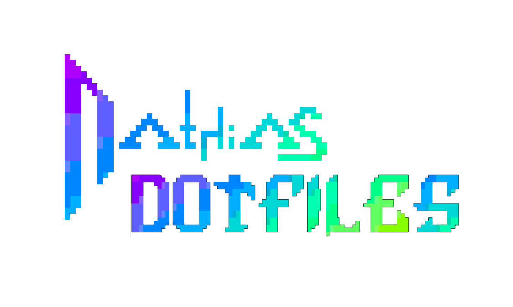

### dotfiles optimized for speed, UNIX as IDE and vim-keys everywhere

## ZSH

### packages

-   zsh
-   antibody
-   zoxide

### plugins

-   denysdovhan/spaceship-prompt
-   zdharma-continuum/fast-syntax-highlighting
-   gko/project
-   gko/ssh-connect
-   thetic/extract
-   zpm-zsh/colors
-   jeffreytse/zsh-vi-mode
-   zsh-users/zsh-completions
-   lukechilds/zsh-better-npm-completion
-   g-plane/zsh-yarn-autocompletions
-   eastokes/aws-plugin-zsh
-   sudosubin/zsh-github-cli

### zshrc

[.zshrc](https://github.com/nath1as/.files/blob/master/zshrc)

## ST

suckless simple terminal (st) with vim bindings and Xresource compatibility.

[repo](https://github.com/nath1as/st)

## NEOVIM

[astronaught theme](https://github.com/nath1as/astronaught-theme)

## FIREFOX

### packages:

-   firefox

### set about:config

-   disable Alt key menu toggle:
    ui.key.menuAccessKeyFocuses to false
-   disable the Quick Find hotkey:
    accessibility.typeaheadfind.manual to false

## CMUS

[theme](https://github.com/nath1as/.files/blob/master/cmus)

## WEECHAT

### packages:

-   weechat
-   bitlbee-discord-git
-   bitlbee-facebook
-   bitlbee-libpurple
-   bitlbee-mastodon-git
-   bitlbee-steam-git

### scripts:

-   colorize_lines
-   autosort
-   automerge
-   bitlbee_completion
-   buffer_dmenu
-   cmus
-   go
-   twitch
-   urlserver
-   vimode
-   weestreamer

## TTY

edit /etc/issue to change login

## PARU

-   Color option in /etc/pacman.conf

## GIT

alias g="git"

### packages

-   git
-   tig
-   lazygit
-   diff-so-fancy
-   git-crypt

### extensions

-   legit
-   github-cli

### .gitconfig

[.gitconfig](https://github.com/nath1as/.files/blob/master/gitconfig)

## Obsidian

### plugins

-   cmdr
-   cm-editor-syntax-highlight-obsidian
-   colorful-note-borders
-   crossbow
-   dataview
-   emoji-shortcodes
-   execute-code
-   homepage
-   janitor
-   link-favicon
-   obsidian-advanced-slides
-   obsidian-advanced-uri
-   obsidian-commits
-   obsidian-excalidraw-plugin
-   obsidian-file-color
-   obsidian-git
-   obsidian-icon-folder
-   obsidian-pandoc
-   obsidian-plugin-update-tracker
-   obsidian-projects
-   obsidian-spaced-repetition
-   omnisearch
-   quick-latex
-   rofi-helper
-   settings-search
-   simple-embeds
-   supercharged-links-obsidian
-   table-editor-obsidian
-   templater-obsidian
-   url-into-selection
-   vim-toggle
-   waypoint
-   writing

## piracy

-   amule
-   rtorrent

BTW, I use Arch
