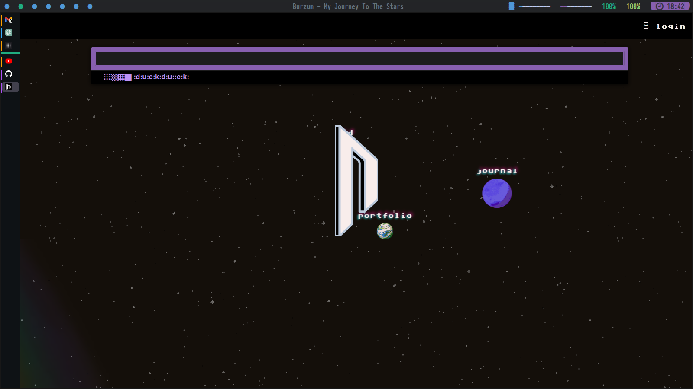

### dotfiles optimized for speed, UNIX as IDE and vim-keys everywhere

## ZSH


### packages

-   zsh
-   antibody
-   zoxide

### plugins

-   denysdovhan/spaceship-prompt
-   zdharma-continuum/fast-syntax-highlighting
-   gko/project
-   gko/ssh-connect
-   thetic/extract
-   zpm-zsh/colors
-   jeffreytse/zsh-vi-mode
-   zsh-users/zsh-completions
-   lukechilds/zsh-better-npm-completion
-   g-plane/zsh-yarn-autocompletions
-   eastokes/aws-plugin-zsh
-   sudosubin/zsh-github-cli

### zshrc

[.zshrc](https://github.com/nath1as/.files/blob/master/zshrc)

## X

```bash
#!/bin/bash
[[ -f ~/.Xresources ]] && xrdb -merge ~/.Xresources
xset -b
st -q -o -f
xrandr --output eDP-1 --mode 1600x900 --rate 60
exec i3
```

## ST

suckless simple terminal (st) with vim bindings and Xresource compatibility.

[repo](https://github.com/nath1as/st)

[dir colors](https://github.com/nath1as/.files/blob/master/dircolors)

## NEOVIM


[astronaught theme](https://github.com/nath1as/astronaught-theme)

## i3

[config](https://github.com/nath1as/.files/blob/master/i3)

## polybar

[config](https://github.com/nath1as/.files/blob/master/polybar)

## FIREFOX



### packages:

-   firefox

### set about:config

-   disable Alt key menu toggle:
    ui.key.menuAccessKeyFocuses to false
-   disable the Quick Find hotkey:
    accessibility.typeaheadfind.manual to false

## CMUS


[theme](https://github.com/nath1as/.files/blob/master/cmus)

## WEECHAT

### packages:

-   weechat
-   bitlbee-discord-git
-   bitlbee-facebook
-   bitlbee-libpurple
-   bitlbee-mastodon-git
-   bitlbee-steam-git

### scripts:

-   colorize_lines
-   autosort
-   automerge
-   bitlbee_completion
-   buffer_dmenu
-   cmus
-   go
-   twitch
-   urlserver
-   vimode
-   weestreamer

## TTY

edit /etc/issue to change login

```
▄▄▌ ▐ ▄▌▄▄▄ .▄▄▌   ▄▄·       • ▌ ▄ ·. ▄▄▄ .
██· █▌▐█▀▄.▀·██•  ▐█ ▌▪▪     ·██ ▐███▪▀▄.▀·
██▪▐█▐▐▌▐▀▀▪▄██▪  ██ ▄▄ ▄█▀▄ ▐█ ▌▐▌▐█·▐▀▀▪▄
▐█▌██▐█▌▐█▄▄▌▐█▌▐▌▐███▌▐█▌.▐▌██ ██▌▐█▌▐█▄▄▌
 ▀▀▀▀ ▀▪ ▀▀▀ .▀▀▀ ·▀▀▀  ▀█▄▀▪▀▀  █▪▀▀▀ ▀▀▀
		▄▄▄▄▄
		•██  ▪
		 ▐█.▪ ▄█▀▄
		 ▐█▌·▐█▌.▐▌
		 ▀▀▀  ▀█▄▀▪

 ▄▄▄· ▄▄▄   ▄▄·  ▄ .▄    ▄▄▌  ▪   ▐ ▄ ▄• ▄▌▐▄• ▄
▐█ ▀█ ▀▄ █·▐█ ▌▪██▪▐█    ██•  ██ •█▌▐██▪██▌ █▌█▌▪
▄█▀▀█ ▐▀▀▄ ██ ▄▄██▀▐█    ██▪  ▐█·▐█▐▐▌█▌▐█▌ ·██·
▐█ ▪▐▌▐█•█▌▐███▌██▌▐▀    ▐█▌▐▌▐█▌██▐█▌▐█▄█▌▪▐█·█▌
 ▀  ▀ .▀  ▀·▀▀▀ ▀▀▀ ·    .▀▀▀ ▀▀▀▀▀ █▪ ▀▀▀ •▀▀ ▀▀
```

## PARU

-   Color option in /etc/pacman.conf

## GIT

alias g="git"

### packages

-   git
-   tig
-   lazygit
-   diff-so-fancy
-   git-crypt

### extensions

-   legit
-   github-cli

### .gitconfig

[.gitconfig](https://github.com/nath1as/.files/blob/master/gitconfig)

## Thunar

.local/share/applications/thunar.desktop

```zsh
[Desktop Entry]
Name=Thunar
Exec=env GTK_THEME=Adwaita:dark thunar %F
Icon=system-file-manager
Terminal=false
Type=Application
Categories=GTK;Utility;FileManager;
```

chmod +x thunar.desktop

## Pulse Audio VolumeControl

.local/share/applications/pavucontrol.desktop

```
[Desktop Entry]
Name=PulseAudio Volume Control
Exec=env GTK_THEME=Adwaita:dark pavucontrol
Icon=multimedia-volume-control
Terminal=false
Type=Application
Categories=GTK;AudioVideo;
```

chmod +x pavucontrol.desktop

## Obsidian


### plugins

-   cmdr
-   cm-editor-syntax-highlight-obsidian
-   colorful-note-borders
-   crossbow
-   dataview
-   emoji-shortcodes
-   execute-code
-   homepage
-   janitor
-   link-favicon
-   obsidian-advanced-slides
-   obsidian-advanced-uri
-   obsidian-commits
-   obsidian-excalidraw-plugin
-   obsidian-file-color
-   obsidian-git
-   obsidian-icon-folder
-   obsidian-pandoc
-   obsidian-plugin-update-tracker
-   obsidian-projects
-   obsidian-spaced-repetition
-   omnisearch
-   quick-latex
-   rofi-helper
-   settings-search
-   simple-embeds
-   supercharged-links-obsidian
-   table-editor-obsidian
-   templater-obsidian
-   url-into-selection
-   vim-toggle
-   waypoint
-   writing

### OPTIMIZE

#### hardware

preloading
[wiki: x1 Carbon gen6](<https://wiki.archlinux.org/title/Lenovo_ThinkPad_X1_Carbon_(Gen_6)>)

## update

fwupd

```zsh
fwupdmgr get-devices
fwupdmgr refresh
fwupdmgr get-updates
fwupdmgr update
```

[update firmware]())

#### preloading

[wiki: preloading](https://wiki.archlinux.org/title/Preload)

install prealod
install gopreload-gitprepare

gopreload-prepare st
gopreload-prepare nvim
gopreload-prepare ranger
gopreload-prepare paru
gopreload-prepare ls

gopreload-prepare firefox
gopreload-prepare google-chrome-stable

### boot

[wiki: optimize boot](https://wiki.archlinux.org/title/Improving_performance/Boot_process)

#### debug

systemctl --user status xdg-desktop-portal-gtk.service

portals make everything slow
